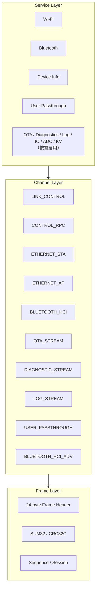
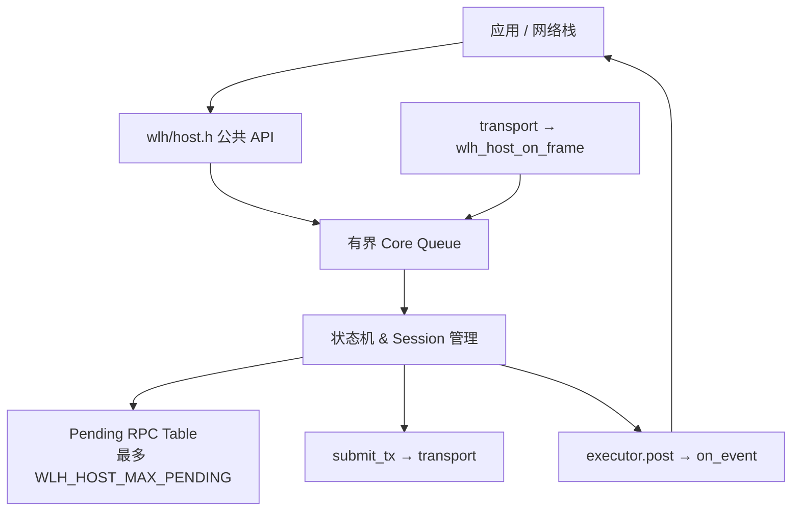
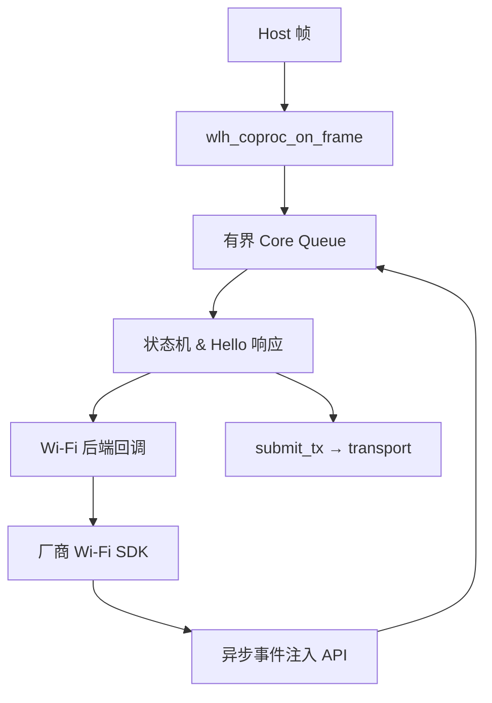
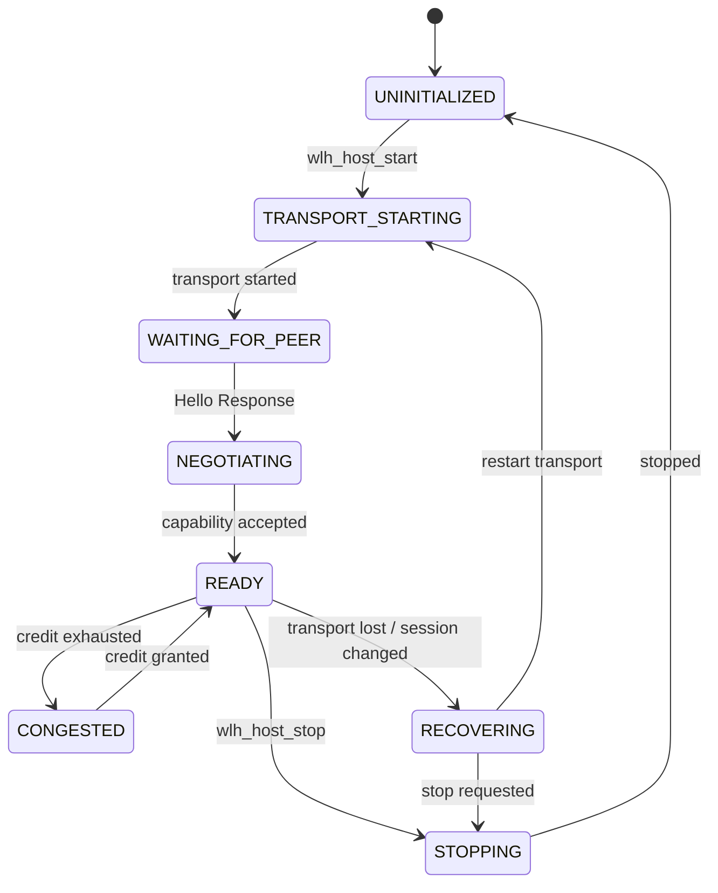
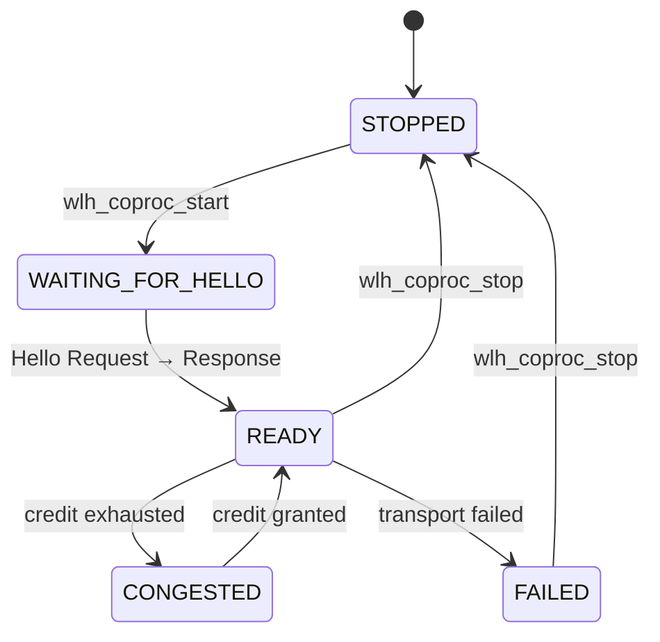

# WL-hosted Core 架构设计

本文档说明 Core 内部的分层模型、Host 与 Coprocessor 的运行时结构、数据/控制面分离原则以及不可违背的不变量。线上帧格式、Service ID、Method ID 等规范请参见 `protocol/spec/`。

## 协议分层

WL-hosted 协议在 Core 内部被抽象为三层：

### Frame Layer

负责字节边界、Channel、长度、Session、Sequence、校验和：

- 固定 24 字节 Header，所有整数 little-endian。
- `magic = 0x4c57`，`protocol_major = 1`，`header_size = 24`。
- 校验和分 SUM32 与 CRC32C 两种，由 `CRC32C_PRESENT` 标志和 Hello 协商共同决定。
- Sequence 每方向、每 Channel 独立递增，接收方检测 Gap。
- Session ID 在 Hello 协商后生效，后续帧必须匹配当前 Session。

### Channel Layer

负责多路复用与每 Channel Credit：

- `LINK_CONTROL`（`0x00`）：仅 Link Service 使用，承载 Hello、Heartbeat、Credit Update。
- `CONTROL_RPC`（`0x01`）：除 Link 外所有 Service 的 Request/Response/Event。
- `ETHERNET_STA`/`ETHERNET_AP`（`0x02`/`0x03`）：原始 L2 frame 数据面。
- `BLUETOOTH_HCI`（`0x04`）：可靠 HCI 数据面（Command/ACL/SCO/Event/ISO）。
- `BLUETOOTH_HCI_ADV`（`0x09`）：best-effort 的 LE 广播/扫描报告事件，发送方无 credit 时直接丢弃，避免阻塞 `BLUETOOTH_HCI` 上的可靠控制事件。
- `OTA_STREAM`、`DIAGNOSTIC_STREAM`、`LOG_STREAM`、`USER_PASSTHROUGH`：其他大数据流通道。

控制面与数据面严格分离。任何 Service 的 RPC 控制不得借道数据 Channel；大数据流也不得塞进 protobuf payload。

### Service Layer

固定 RPC Envelope + protobuf payload：

- Envelope 固定 16 字节：`service_id`、`method_id`、`request_id`、`kind`、`flags`、`payload_size`、`status_domain`、`status_code`。
- `kind` 区分 Request（1）、Response（2）、Event（3）。
- 异步操作的结果 Event 应复用原 `request_id`；纯状态广播可使用 0。

## Host 运行时结构

Host Core 是协议客户端，负责驱动 Wi-Fi/设备信息/用户透传等 RPC，并管理数据面 Ethernet 发送。

Host Core 单任务运行：所有状态转换、RPC 匹配、sequence/credit 管理都在 OSAL Core task 中串行完成。公共 API 只是把请求入队，不会在中断或应用线程中直接修改状态机。

## Coprocessor 运行时结构

Coprocessor Core 是协议服务端，负责响应 Hello、执行 Wi-Fi 后端操作、注入异步事件、转发 Ethernet 数据。

后端回调（`initialize`、`scan`、`connect` 等）必须是非阻塞提交；最终结果通过 `wlh_coproc_wifi_scan_result`、`wlh_coproc_wifi_connected` 等入口注入回 Core。这样厂商 ISR 或其他 RTOS 任务不会重入协议分发器。

## 状态机

### Host Core 状态机

### Coprocessor Core 状态机

## 队列与所有权模型

Core 内部使用一个有界队列驱动 Core task：

- Host：`core_queue` 深度可配置，条目为 `wlh_host_job_t`（kind + payload 指针）。
- Coprocessor：`core_queue` 深度可配置，条目为 `coproc_job_t`。

关键所有权规则：

1. `submit_tx` 成功返回后，帧 buffer 的所有权转移给 transport；transport 必须在 `tx_complete` 回调中归还（通过 buffer free 或重新提交）。
2. `wlh_host_on_frame()` / `wlh_coproc_on_frame()` 是**非阻塞入口**，Core 会复制帧内容到内部 buffer 后再处理，调用者可以立即释放原始帧。
3. 事件与 RPC completion 通过 `executor.post` 投递到应用线程；事件 payload 在回调返回前有效。
4. Wi-Fi 后端回调不能持有 Core 内部 buffer 的引用；必须复制需要的 SSID/BSSID/凭证。

## 核心不变量

以下不变量必须始终成立，Adapter 与后端实现不得破坏：

- **不发送 C struct / bitfield / 指针 / RTOS handle / 厂商 enum 到线上**。
- 所有整数端序与长度逐字节定义；protobuf 字段遵循 protobuf wire encoding。
- SSID 是任意字节串，不假定 UTF-8 或 NUL 终止；MAC/BSSID/BLE 地址恰好 6 字节。
- 能力协商是上限来源。厂商 SDK 的扫描缓存、VIF 数量、AP 客户端数不得成为 wire 常量。
- 事件中的 `request_id` 仅用于关联异步操作；响应必须由 Envelope 的 `request_id + session_id` 精确匹配。
- Core 内部所有队列、pending table、buffer pool 都有界；禁止无界增长。
- 禁止在 ISR 中直接调用 Core 状态机；ISR 只能调用 OSAL 的 `*_from_isr` 或把事件入队到 Adapter 任务。

## 与 protocol/spec 的分工

| 内容 | 位置 |
|---|---|
| Wire format、Service registry、protobuf schema、Channel 定义 | `protocol/spec/` |
| Core 内部状态机、API 使用、OSAL 回调、Adapter 集成 | `doc/`（本文档集） |

下一篇推荐阅读：[osal.md](osal.md)。
