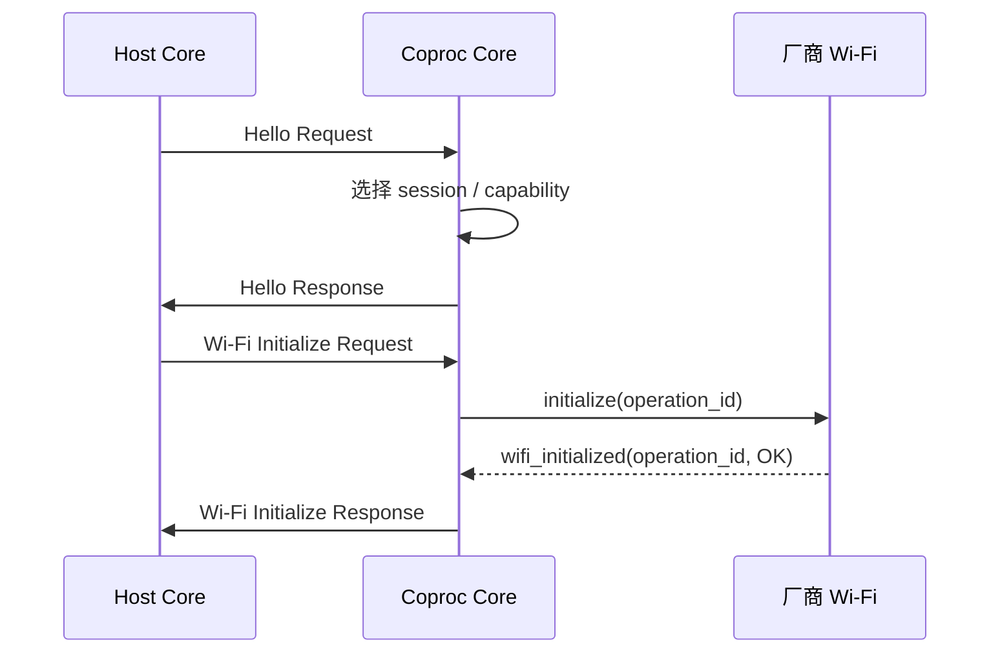

# Coprocessor Core 集成指南

Coprocessor Core 是 WL-hosted 协议在无线 Coprocessor 上的服务端运行时，负责响应 Host 的 Hello、执行 Wi-Fi 后端操作、注入异步事件、转发 Ethernet 数据以及可选的设备信息与用户透传服务。本文档说明如何配置与集成 `wlh/coproc.h` 提供的 API。

## 公共 API 概览

```c
wlh_coproc_result_t wlh_coproc_init(wlh_coproc_t *coproc, const wlh_coproc_config_t *config);
wlh_coproc_result_t wlh_coproc_start(wlh_coproc_t *coproc);
wlh_coproc_result_t wlh_coproc_stop(wlh_coproc_t *coproc);
wlh_coproc_result_t wlh_coproc_on_frame(wlh_coproc_t *coproc, const uint8_t *frame, size_t size);

wlh_coproc_result_t wlh_coproc_wifi_scan_result(...);
wlh_coproc_result_t wlh_coproc_wifi_initialized(...);
wlh_coproc_result_t wlh_coproc_wifi_scan_completed(...);
wlh_coproc_result_t wlh_coproc_wifi_connected(...);
wlh_coproc_result_t wlh_coproc_wifi_disconnected(...);
wlh_coproc_result_t wlh_coproc_wifi_ap_client_joined(...);
wlh_coproc_result_t wlh_coproc_wifi_ap_client_left(...);
wlh_coproc_result_t wlh_coproc_ethernet_sta_send(...);
wlh_coproc_result_t wlh_coproc_ethernet_ap_send(...);
wlh_coproc_result_t wlh_coproc_user_message_result(...);

wlh_coproc_result_t wlh_coproc_bluetooth_operation_complete(...);
wlh_coproc_result_t wlh_coproc_bluetooth_info_result(...);
wlh_coproc_result_t wlh_coproc_bluetooth_hci_send(...);
wlh_coproc_result_t wlh_coproc_bluetooth_fatal_error(...);

void wlh_coproc_get_diagnostics(const wlh_coproc_t *coproc, wlh_coproc_diagnostics_t *diagnostics);
```

## 配置结构体

`wlh_coproc_config_t` 包含以下回调组：

### port

```c
typedef struct wlh_coproc_port {
    void *context;
    wlh_coproc_submit_tx_fn submit_tx;
    wlh_coproc_ethernet_rx_fn ethernet_sta_rx;
} wlh_coproc_port_t;
```

- `submit_tx`：Core 把待发送帧交给 transport。
- `ethernet_sta_rx`：Core 收到 Ethernet STA 帧后，通过该回调交给网络栈；必须是非阻塞的拷贝/入队。

### wifi

```c
typedef struct wlh_coproc_wifi_ops {
    void *context;
    wlh_wifi_initialize_fn initialize;
    wlh_wifi_scan_fn scan;
    wlh_wifi_connect_fn connect;
    wlh_wifi_disconnect_fn disconnect;
    wlh_wifi_start_ap_fn start_ap;
    wlh_wifi_stop_ap_fn stop_ap;
} wlh_coproc_wifi_ops_t;
```

所有回调都必须是非阻塞提交；结果通过后续注入 API 返回。

### device_info

```c
typedef struct wlh_coproc_device_info_ops {
    void *context;
    wlh_coproc_get_device_info_fn get_info;
} wlh_coproc_device_info_ops_t;
```

可选。`get_info` 运行在 Core task，需快速填充 `vendor`、`mcu_model`、`uid`、`board_profile` 并返回 0。

### user_passthrough

```c
typedef struct wlh_coproc_user_passthrough_ops {
    void *context;
    wlh_coproc_user_message_fn on_message;
} wlh_coproc_user_passthrough_ops_t;
```

可选。`on_message` 收到 Host 发送的用户消息，返回 0 表示接受。

### bluetooth

```c
typedef struct wlh_coproc_bluetooth_ops {
    void *context;
    wlh_bluetooth_initialize_fn initialize;
    wlh_bluetooth_enable_fn enable;
    wlh_bluetooth_disable_fn disable;
    wlh_bluetooth_deinitialize_fn deinitialize;
    wlh_bluetooth_get_info_fn get_info;
    wlh_bluetooth_hci_send_fn hci_send;
    wlh_bluetooth_hci_tx_ready_fn hci_tx_ready;
} wlh_coproc_bluetooth_ops_t;
```

可选。所有生命周期操作都是非阻塞提交，结果通过 `wlh_coproc_bluetooth_operation_complete()` / `wlh_coproc_bluetooth_info_result()` 返回。

- `initialize`/`enable`/`disable`/`deinitialize`/`get_info`：按 Host 命令触发，需用对应的 `operation_id` 完成。
- `hci_send`：Host→Controller HCI 包，`payload` 不含 H4 type 字节，仅在该调用期间有效。返回非 0 表示致命错误，Core 会停止 HCI 并进入 ERROR 状态。
- `hci_tx_ready`：Controller→Host 方向可用 credit 从 0 变正时触发，用于通知后端恢复发送。

### buffers / osal

与 Host Core 相同。参见 [host_core_integration.md](host_core_integration.md) 与 [osal.md](osal.md)。

### 数值参数

| 字段 | 建议值 | 说明 |
|---|---|---|
| `max_frame_size` | 4096 | 协商上限 |
| `heartbeat_interval_ms` | 3000 | Coprocessor 发送心跳周期 |
| `initial_credit` | 16 | 每个数据 Channel 初始 credit |
| `initial_session_id` | 非 0 | 第一个 session ID |
| `core_queue_depth` | ≤ 32 | 受 `WLH_COPROC_MAX_QUEUE_DEPTH` 限制 |
| `stop_timeout_ms` | 5000 | 等待 Core task 退出 |

## Hello 协商

Coprocessor 启动后进入 `WAITING_FOR_HELLO` 状态。收到 Host 的 Hello Request 后，Core 自动生成 Hello Response，选择 session ID、协议版本、校验模式、credit 等。



## Wi-Fi 后端回调约定

### initialize

```c
int my_wifi_initialize(
    void *context, uint32_t operation_id, uint32_t interface_flags
);
```

- `interface_flags` 是 Host 在 `WifiInitializeRequest` 中声明的接口 bitmap：bit0 表示 STA，bit1 表示 AP。
- 收到后应尽快启动厂商 Wi-Fi 初始化，并按 `interface_flags` 启用对应的 STA/AP 接口。
- 初始化完成后调用 `wlh_coproc_wifi_initialized(coproc, operation_id, backend_status)`。
- `backend_status` 为 0 表示成功；非 0 会映射为错误响应。

### scan

```c
int my_wifi_scan(void *context, uint32_t scan_id);
```

- 启动扫描。
- 每个 BSS 通过 `wlh_coproc_wifi_scan_result()` 注入。
- 扫描结束通过 `wlh_coproc_wifi_scan_completed()` 注入。

### connect

```c
int my_wifi_connect(void *context, const wlh_coproc_wifi_connect_t *request);
```

- 提取 `ssid`、`credential`、`security`，启动连接。
- 连接成功调用 `wlh_coproc_wifi_connected()`；失败调用 `wlh_coproc_wifi_disconnected()`。

### disconnect

```c
int my_wifi_disconnect(void *context);
```

- 启动断开。
- 断开后调用 `wlh_coproc_wifi_disconnected(reason, locally_initiated)`。

### start_ap / stop_ap

与 connect/disconnect 类似，分别启动/停止 SoftAP。

## Bluetooth 后端回调约定

所有回调运行在 Core task，必须是非阻塞提交。

### initialize / enable / disable / deinitialize / get_info

```c
int my_bluetooth_initialize(void *context, uint32_t operation_id, uint32_t feature_flags);
int my_bluetooth_enable(void *context, uint32_t operation_id, uint32_t mode_flags);
int my_bluetooth_disable(void *context, uint32_t operation_id);
int my_bluetooth_deinitialize(void *context, uint32_t operation_id, bool release_memory);
int my_bluetooth_get_info(void *context, uint32_t operation_id);
```

完成后调用：

```c
wlh_coproc_bluetooth_operation_complete(coproc, operation_id, backend_status);
// get_info 成功时额外携带信息：
wlh_coproc_bluetooth_info_result(coproc, operation_id, 0, &info);
```

`backend_status` 为 0 表示成功；非 0 会映射为错误响应或 `BluetoothStateChangedEvent` 的原因。

### hci_send

```c
int my_bluetooth_hci_send(
    void *context, uint8_t h4_type, const uint8_t *payload, size_t payload_size
);
```

收到 Host→Controller HCI 包。应拷贝或立即处理；返回非 0 会被 Core 视为致命错误，停止 HCI 并进入 ERROR 状态。

## 事件注入 API

所有注入 API 都是非阻塞的，可以在任意任务上下文调用（但不能在 ISR 中调用）：

```c
wlh_coproc_wifi_scan_result(coproc, scan_id, &bss);
wlh_coproc_wifi_scan_completed(coproc, scan_id, result_count, false);
wlh_coproc_wifi_connected(coproc, &bss);
wlh_coproc_wifi_disconnected(coproc, reason, false);
wlh_coproc_wifi_ap_client_joined(coproc, mac, rssi, assoc_id);
wlh_coproc_wifi_ap_client_left(coproc, mac, assoc_id, ieee_reason);
wlh_coproc_ethernet_sta_send(coproc, frame, size);
wlh_coproc_user_message_result(coproc, endpoint, type, correlation_id, result, payload, size);

/* Bluetooth */
wlh_coproc_bluetooth_operation_complete(coproc, operation_id, 0);
wlh_coproc_bluetooth_info_result(coproc, operation_id, 0, &info);
wlh_coproc_bluetooth_hci_send(coproc, WLH_H4_TYPE_EVENT, event, event_size);
```

## Bluetooth 数据面

Coprocessor 收到 Controller→Host HCI 包后：

```c
wlh_coproc_bluetooth_hci_send(coproc, h4_type, packet, packet_size);
```

Core 会把它封装为 HCI Raw Record 发送给 Host。 reliable HCI（Command Complete/Status、连接事件、SM、ACL 等）走 `WLH_CHANNEL_BLUETOOTH_HCI`；LE 广播/扫描报告事件如果 Host 在 Hello 中声明了 `WLH_CHANNEL_BLUETOOTH_HCI_ADV`，则走该 best-effort 通道。该通道 credit 窗口很小（默认 4），无 credit 时 Core 返回 `WLH_COPROC_NO_CREDIT`，后端应保留数据并在 `hci_tx_ready` 触发后重试；对于广播报告这类可丢弃数据，后端也可以选择直接丢弃。

如果后端检测到无法恢复的 HCI 错误（例如连续收到畸形包），可调用：

```c
wlh_coproc_bluetooth_fatal_error(coproc, WLH_COPROC_BLUETOOTH_REASON_MALFORMED_HCI);
```

Core 会把 Controller 状态机移入 `ERROR` 并广播 `BluetoothStateChangedEvent`。

## Ethernet 数据面

Coprocessor 收到 Ethernet 帧后：

```c
wlh_coproc_ethernet_sta_send(coproc, ethernet_frame, size);
```

Core 会封装成 Frame 并通过 `submit_tx` 发送给 Host。Host 发送给 Coprocessor 的 Ethernet 帧则通过 `ethernet_sta_rx` 回调交给后端网络栈。

## 用户透传

收到 Host 的用户消息后，`on_message` 被调用。如果需要异步返回结果：

```c
wlh_coproc_user_message_result(
    coproc,
    message->endpoint_id,
    message->message_type,
    message->request_id,   // 关联原请求
    result,
    payload, payload_size
);
```

## 线程安全规则

- 公共 API 可以在任意任务上下文中调用，但不得在中断上下文中调用。
- Wi-Fi 后端回调运行在 Core task，不能阻塞，不能调用可能长时间等待的 SDK API。
- 后端事件注入 API 是线程安全的，内部会复制数据。
- `wlh_coproc_on_frame()` 不能在 ISR 中调用。

## 诊断

```c
wlh_coproc_diagnostics_t diag;
wlh_coproc_get_diagnostics(coproc, &diag);
```

包含状态、session_id、tx/rx 帧数、checksum 错误、sequence gap、RPC 请求数、peer reset 等，还包含 `hci_malformed`、`hci_drops`、`hci_adv_drops`、`bluetooth_mismatches` 等 Bluetooth 相关计数。

## 常见集成错误

- 在 `wifi.scan` 中同步等待扫描完成，阻塞 Core task。
- 忘记在初始化完成后调用 `wlh_coproc_wifi_initialized()`。
- 在 ISR 中调用 `wlh_coproc_wifi_connected()` 等注入 API。
- `submit_tx` 成功后未在 tx_complete 中释放 buffer。
- `ethernet_sta_rx` 中直接处理完整网络栈路径，导致 Core task 阻塞。
- 在 `bluetooth.hci_send` 中同步等待硬件发送完成。
- 收到畸形 HCI 后未调用 `wlh_coproc_bluetooth_fatal_error()` 而继续发送错误数据。

下一篇推荐阅读：[lifecycle.md](lifecycle.md)。
