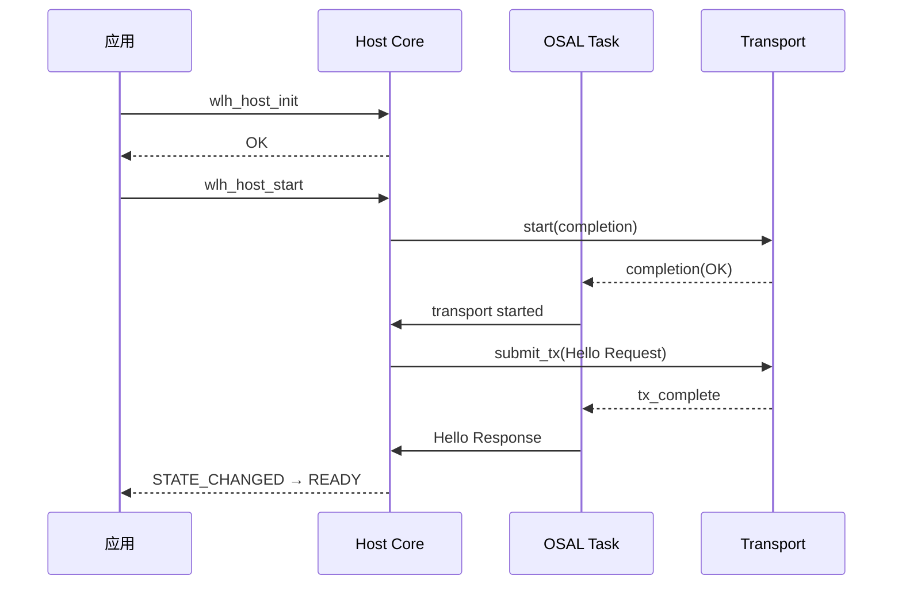

# Host Core 集成指南

Host Core 是 WL-hosted 协议在 Host 侧的客户端运行时，负责链路协商、RPC 请求/响应匹配、session 与 sequence 管理、credit 控制、Wi-Fi 控制面以及 Ethernet 数据面发送。本文档说明如何配置与集成 `wlh/host.h` 提供的 API。

## 公共 API 概览

```c
wlh_host_result_t wlh_host_init(wlh_host_t *host, const wlh_host_config_t *config);
wlh_host_result_t wlh_host_start(wlh_host_t *host);
wlh_host_result_t wlh_host_stop(wlh_host_t *host);
wlh_host_result_t wlh_host_on_frame(wlh_host_t *host, const uint8_t *frame, size_t size);
void wlh_host_transport_lost(wlh_host_t *host);

wlh_host_result_t wlh_host_rpc_request(
    wlh_host_t *host,
    uint16_t service_id, uint16_t method_id,
    const uint8_t *payload, size_t payload_size,
    uint32_t timeout_ms,
    wlh_rpc_completion_fn completion, void *completion_context,
    uint32_t *request_id
);

wlh_host_result_t wlh_host_wifi_initialize(...);
wlh_host_result_t wlh_host_wifi_scan(...);
wlh_host_result_t wlh_host_wifi_connect(...);
wlh_host_result_t wlh_host_wifi_disconnect(...);
wlh_host_result_t wlh_host_wifi_start_ap(...);
wlh_host_result_t wlh_host_wifi_stop_ap(...);
wlh_host_result_t wlh_host_get_device_info(...);
wlh_host_result_t wlh_host_user_message_send(...);
wlh_host_result_t wlh_host_ethernet_sta_send(...);
wlh_host_result_t wlh_host_ethernet_ap_send(...);

void wlh_host_get_diagnostics(const wlh_host_t *host, wlh_host_diagnostics_t *diagnostics);
```

## 配置结构体

`wlh_host_config_t` 是集成入口，包含以下回调组：

### transport

```c
typedef struct wlh_transport_ops {
    void *context;
    wlh_transport_start_fn start;
    wlh_transport_stop_fn stop;
    wlh_transport_submit_tx_fn submit_tx;
} wlh_transport_ops_t;
```

- `start` / `stop`：异步生命周期控制，完成时调用 completion。
- `submit_tx`：Core 把待发送帧交给 transport。

### buffers

```c
typedef struct wlh_buffer_ops {
    void *context;
    wlh_buffer_alloc_fn alloc;
    wlh_buffer_free_fn free;
} wlh_buffer_ops_t;
```

Core 使用 alloc/free 分配事件、completion、内部帧拷贝等。必须是线程安全的。

### osal

传入 `wlh_osal_ops_t`，通常来自 POSIX/FreeRTOS adapter 或自定义实现。参见 [osal.md](osal.md)。

### executor

```c
typedef struct wlh_executor_ops {
    void *context;
    wlh_executor_post_fn post;
} wlh_executor_ops_t;
```

用于把 `on_event` 回调投递到应用线程，避免在 Core task 中直接调用应用代码。

### on_event

```c
typedef void (*wlh_host_event_fn)(void *context, const wlh_host_event_t *event);
```

事件类型包括：

| 事件 | 含义 |
|---|---|
| `WLH_HOST_EVENT_STATE_CHANGED` | Core 状态变化 |
| `WLH_HOST_EVENT_WIFI_SCAN_RESULT` | 单个 BSS 结果 |
| `WLH_HOST_EVENT_WIFI_SCAN_COMPLETED` | 扫描完成 |
| `WLH_HOST_EVENT_WIFI_CONNECTED` | STA 已连接 |
| `WLH_HOST_EVENT_WIFI_DISCONNECTED` | STA 已断开 |
| `WLH_HOST_EVENT_ETHERNET_STA_RX` | 收到 Ethernet 帧 |
| `WLH_HOST_EVENT_ETHERNET_AP_RX` | 收到 SoftAP Ethernet 帧 |
| `WLH_HOST_EVENT_PROTOCOL_FAULT` | 协议错误 |
| `WLH_HOST_EVENT_USER_MESSAGE_RESULT` | User Passthrough 结果事件 |
| `WLH_HOST_EVENT_WIFI_AP_CLIENT_JOINED` | SoftAP 有客户端加入 |
| `WLH_HOST_EVENT_WIFI_AP_CLIENT_LEFT` | SoftAP 有客户端离开 |

### 数值参数

| 字段 | 建议值 | 说明 |
|---|---|---|
| `max_frame_size` | 2048 / 4096 | 协商上限，不能超过 transport 能力 |
| `rpc_timeout_ms` | 30000 | RPC 默认超时 |
| `heartbeat_timeout_ms` | 10000 | 超过此时间未收到对端活动则触发恢复 |
| `max_pending_rpc` | ≤ 16 | 同时挂起的 RPC 数，受 `WLH_HOST_MAX_PENDING` 限制 |
| `core_queue_depth` | ≤ 32 | Core 任务队列深度，受 `WLH_HOST_MAX_QUEUE_DEPTH` 限制 |
| `stop_timeout_ms` | 5000 | 等待 Core task 退出的超时 |

## 初始化与启动时序



## RPC 调用流程

所有 Wi-Fi / 设备信息 / 用户透传 API 本质上都是封装好的 RPC 请求。通用入口是 `wlh_host_rpc_request`：

```c
wlh_host_rpc_request(
    host,
    WLH_SERVICE_WIFI, WLH_WIFI_METHOD_SCAN,
    payload, payload_size,
    30000,
    my_completion, my_context,
    &request_id
);
```

- 调用立即返回；结果通过 `completion` 回调返回。
- 如果 `completion` 为 NULL，请求将作为单向请求发送，不等待响应。
- `request_id` 用于关联后续异步事件。

## Wi-Fi 使用流程

### 扫描

```c
wlh_wifi_scan_params_t params = {
    .scan_id = 1,
    .ssid = NULL,
    .ssid_size = 0,
    .include_hidden = true,
    .max_results = 50
};
wlh_host_wifi_scan(host, &params, scan_completion, context);
```

扫描过程中会收到多次 `WLH_HOST_EVENT_WIFI_SCAN_RESULT`，最后收到 `WLH_HOST_EVENT_WIFI_SCAN_COMPLETED`。

### 连接

```c
wlh_wifi_connect_params_t params = {
    .ssid = (const uint8_t *)"my-ap",
    .ssid_size = 5,
    .credential = (const uint8_t *)"password",
    .credential_size = 8,
    .security = WLH_WIFI_SECURITY_WPA2_PSK,
    .timeout_ms = 30000
};
wlh_host_wifi_connect(host, &params, connect_completion, context);
```

连接成功后会收到 `WLH_HOST_EVENT_WIFI_CONNECTED`；断开时收到 `WLH_HOST_EVENT_WIFI_DISCONNECTED`。

### SoftAP

```c
wlh_wifi_start_ap_params_t params = {
    .ssid = (const uint8_t *)"wlh-ap",
    .ssid_size = 6,
    .credential = (const uint8_t *)"12345678",
    .credential_size = 8,
    .security = WLH_WIFI_SECURITY_WPA2_PSK,
    .channel = 6,
    .max_clients = 4
};
wlh_host_wifi_start_ap(host, &params, start_ap_completion, context);
```

客户端加入/离开事件：`WLH_HOST_EVENT_WIFI_AP_CLIENT_JOINED`、`WLH_HOST_EVENT_WIFI_AP_CLIENT_LEFT`。

## Ethernet 数据面

Host 发送 Ethernet 帧：

```c
wlh_host_ethernet_sta_send(host, frame, size);
```

接收通过 `WLH_HOST_EVENT_ETHERNET_STA_RX` 事件，payload 为完整 L2 frame。

## 用户透传

发送：

```c
wlh_host_user_message_send(
    host,
    endpoint_id, message_type, flags,
    payload, payload_size,
    send_completion, context
);
```

`send_completion` 表示对端已收到 SEND；如果 Coprocessor 后续发送 RESULT，会通过 `WLH_HOST_EVENT_USER_MESSAGE_RESULT` 事件上报。

## 诊断

```c
wlh_host_diagnostics_t diag;
wlh_host_get_diagnostics(host, &diag);
```

包含状态、session_id、pending_rpc、tx/rx 帧数、checksum 错误、sequence gap、buffer 分配失败等。

## 线程安全规则

- 公共 API 可以在任意任务上下文中调用，但不得在中断上下文中调用。
- `on_event` 与 `completion` 回调运行在 `executor.post` 指定的上下文。
- 不要在 `on_event` 或 `completion` 中阻塞或执行耗时操作。
- `wlh_host_on_frame()` 是线程安全的非阻塞入口，但不能在 ISR 中调用。

## 常见集成错误

- 在 `transport.start` 中同步调用 completion。
- `submit_tx` 成功后未在 tx_complete 中释放 buffer。
- 在 `on_event` 中再次调用 Host Core API 导致死锁。
- 使用 wall clock 实现 `monotonic_time_ms`。
- `max_pending_rpc` 超过 `WLH_HOST_MAX_PENDING`（16）。

下一篇推荐阅读：[coproc_core_integration.md](coproc_core_integration.md) 或 [lifecycle.md](lifecycle.md)。
