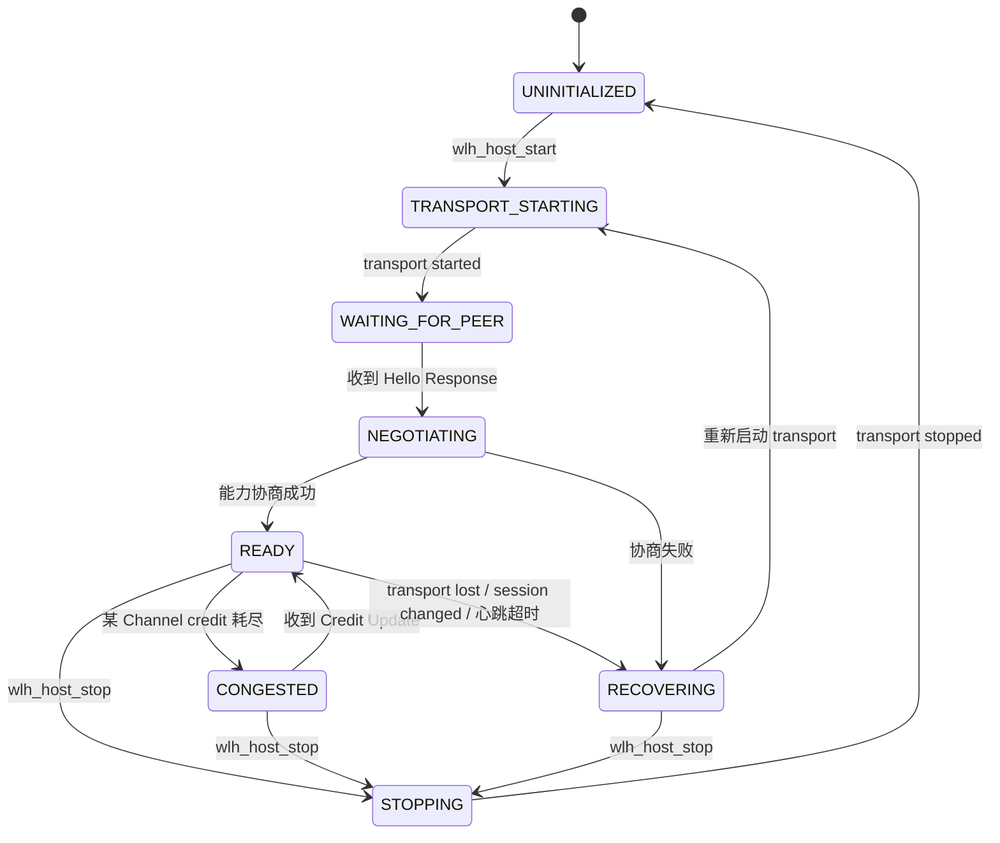
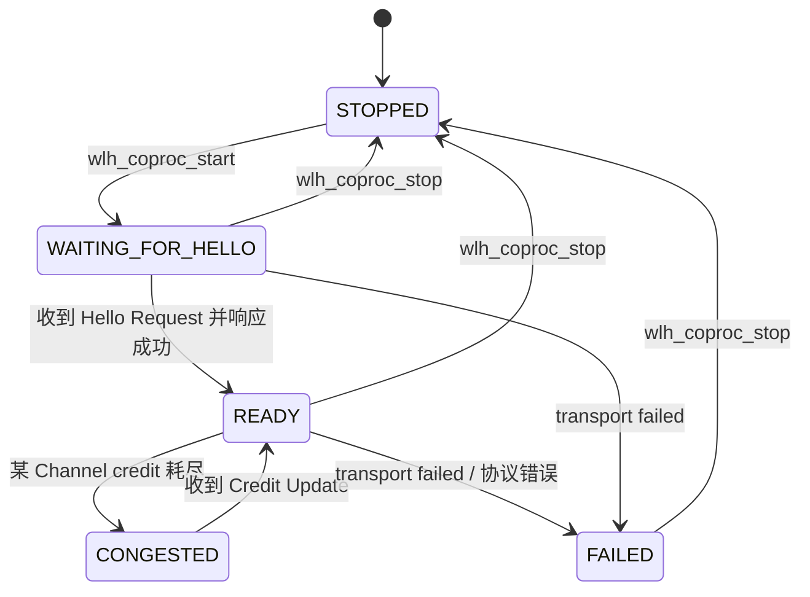
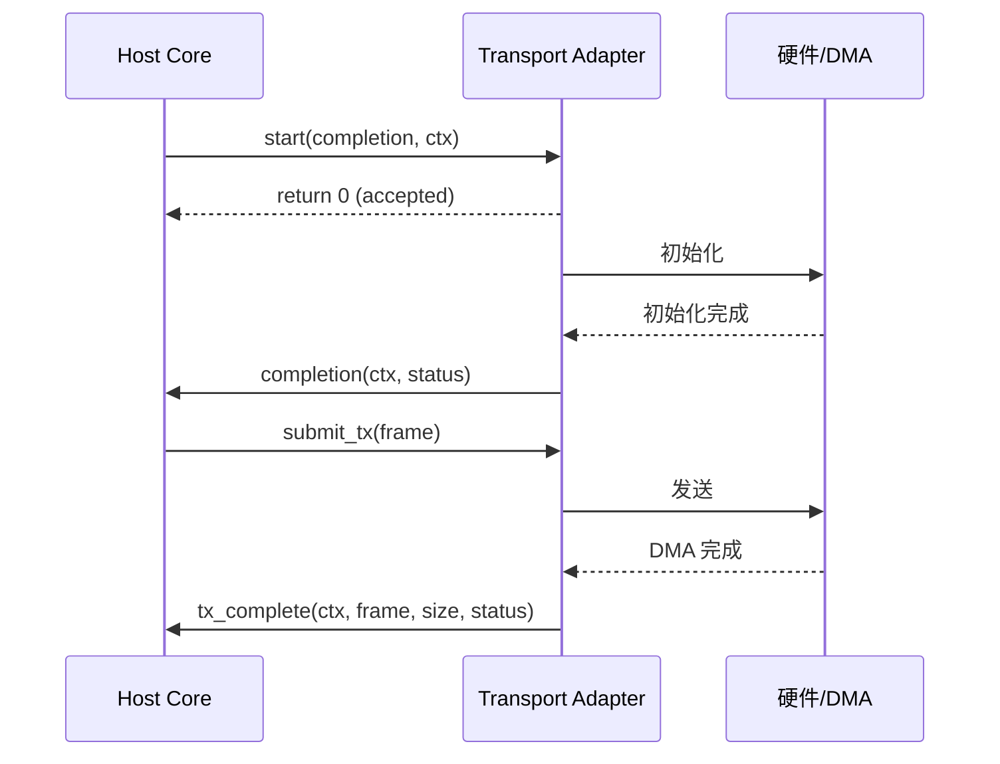

# WL-hosted Core 生命周期

本文档说明 Host Core 与 Coprocessor Core 的初始化、启动、运行、拥塞、断开、恢复与停止的完整生命周期，以及 transport 异步生命周期约定。

## 通用原则

- Core 不主动轮询；空闲时 OSAL queue 阻塞到下一个心跳或 RPC 超时。
- transport start/stop 是异步提交，完成状态通过 completion 回调一次性上报。
- 所有状态转换都在 Core task 中串行完成，外部只能提交 job 或调用入口函数。

## Host Core 生命周期

### 状态机



### 各阶段说明

#### UNINITIALIZED

`wlh_host_init()` 后的初始状态。此时 Core task 尚未创建，transport 未启动。

#### TRANSPORT_STARTING

`wlh_host_start()` 调用后进入。Core 调用 `transport.start(completion)`，然后等待 completion 回调。如果 completion 返回失败，Core 会尝试重试或进入 FAILED。

#### WAITING_FOR_PEER

transport 启动成功后进入。Core 等待来自 Coprocessor 的 Hello Response。如果 `heartbeat_timeout_ms` 内未收到任何有效帧，触发恢复。

#### NEGOTIATING

收到 Hello Response 后进入。Core 检查协议 major/minor、校验模式、max_frame_size、credit 等能力。如果协商失败，进入 RECOVERING。

#### READY

协商成功后进入。此时可以发送 RPC、Wi-Fi 命令、Ethernet 数据。应用会收到 `WLH_HOST_EVENT_STATE_CHANGED`。

#### CONGESTED

当某个非 LINK_CONTROL Channel 的 tx_credit 为 0 时进入。Core 会停止发送该 Channel 的数据，但继续处理心跳和 credit update。收到 credit 后恢复 READY。

#### RECOVERING

以下情况触发：

- transport 断开或 `wlh_host_transport_lost()` 被调用。
- 收到对端 session 与当前不一致。
- 心跳超时（长时间无对端活动）。
- 协议错误无法恢复。

Core 会：

1. 丢弃所有 pending RPC，向 completion 回调报告 `WLH_HOST_SESSION_CHANGED` 或 `WLH_HOST_TRANSPORT_ERROR`。
2. 调用 `transport.stop(completion)` 等待停止完成。
3. 重新回到 TRANSPORT_STARTING，开始新一轮恢复。

#### STOPPING

`wlh_host_stop()` 调用后进入。Core 停止接收新请求，等待 Core task 优雅退出，调用 `transport.stop()` 并释放资源。完成后回到 UNINITIALIZED。

## Coprocessor Core 生命周期

### 状态机



### 各阶段说明

#### STOPPED

`wlh_coproc_init()` 后的初始状态。

#### WAITING_FOR_HELLO

`wlh_coproc_start()` 后进入。Coprocessor 等待 Host 的 Hello Request，收到后立即生成 Hello Response。如果 transport 失败，进入 FAILED。

#### READY

Hello 协商成功后进入。Core 可以接收 RPC 请求、转发 Ethernet、注入 Wi-Fi 事件。

#### CONGESTED

与 Host Core 类似，tx_credit 耗尽时进入。收到 credit 后恢复。

#### FAILED

transport 失败或严重协议错误时进入。Coprocessor 不会自动恢复，需要上层调用 `wlh_coproc_stop()` 后重新 `wlh_coproc_start()`。

## Transport 异步生命周期

transport start 和 stop 都是异步的，这是为了适配需要 DMA 初始化、SDIO 枚举、USB 枚举等耗时操作的硬件。



约定：

- `start` / `stop` 返回 0 仅表示请求被接受，不代表成功。
- `completion` 必须且只能调用一次。
- `completion` 不能 inline 调用，必须延迟到 transport 自己的任务上下文。
- `tx_complete` 必须最终调用，归还 buffer 所有权。

## 恢复触发条件

| 触发条件 | Host Core 行为 | Coprocessor Core 行为 |
|---|---|---|
| transport 断开 | 进入 RECOVERING，自动重启 transport | 进入 FAILED，等待上层重启 |
| 心跳超时 | 进入 RECOVERING | 不触发（Coprocessor 负责发送心跳） |
| session 不匹配 | 进入 RECOVERING | 进入 FAILED |
| sequence gap | 进入 RECOVERING | 进入 FAILED |
| checksum 错误持续 | 进入 RECOVERING | 进入 FAILED |
| credit 耗尽 | 进入 CONGESTED，不恢复 | 进入 CONGESTED，不恢复 |

## 停止流程

### Host

```c
wlh_host_stop(host);
```

1. 设置 `worker_stopping`。
2. 向 Core queue 发送 STOP job。
3. Core task 退出主循环。
4. 调用 `transport.stop(completion)`。
5. 等待 completion 和 task_join。
6. 回到 UNINITIALIZED。

### Coprocessor

```c
wlh_coproc_stop(coproc);
```

流程与 Host 类似，最终回到 STOPPED。

## 注意事项

- 不要在 `on_event` 或 completion 回调中调用 `wlh_host_stop()` / `wlh_coproc_stop()`，可能死锁。应通过另一个任务发起停止。
- 恢复过程中，旧的 pending RPC 会被取消，completion 会收到错误码；应用需要做好重试或状态重置。
- `stop_timeout_ms` 是等待 Core task 和 transport stop 的总超时，超时不代表资源已完全释放，但 Core 会尽力清理。

下一篇推荐阅读：[wire_protocol_usage.md](wire_protocol_usage.md)。
