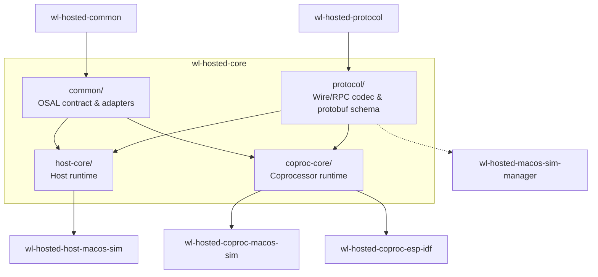
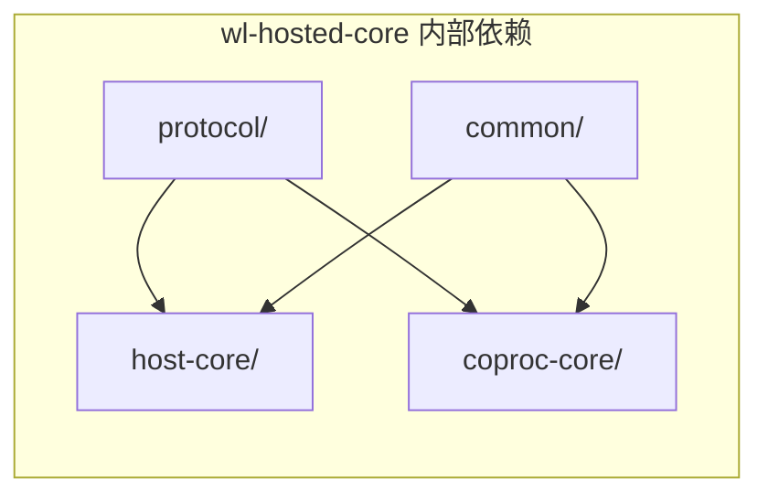

# WL-hosted Core 概览

WL-hosted Core 是 WL-hosted v1 协议的平台无关实现仓库，包含协议编解码、共享 OSAL 契约、Host 运行时和 Coprocessor 运行时四个子目录。它以 C99 编写，不依赖 pthread、Unix socket、poll/kqueue 或动态线程模型，目标是在 MCU、RTOS 与 POSIX 桌面环境之间保持可移植。

## 仓库定位

在 WL-hosted 多仓库工作区中，Core 处于承上启下的位置：

- 上游：定义标准协议的 `wl-hosted-protocol` 与定义共享 OSAL 契约的 `wl-hosted-common`。
- 中游：本仓库的 `protocol/`、`common/`、`host-core/`、`coproc-core/`。
- 下游：具体平台的 Adapter，例如 `wl-hosted-host-macos-sim`、`wl-hosted-coproc-macos-sim`、`wl-hosted-coproc-esp-idf`，以及负责进程管理的 `wl-hosted-macos-sim-manager`。



> 说明：Manager 仅依赖 Protocol 层的 wire 解析，用于在 IPC record 与裸 wire frame 之间桥接真实设备；它不直接依赖 Core 的运行时。

## 四目录职责

| 目录 | 职责 | 主要公共头文件 |
|---|---|---|
| `protocol/` | Frame/RPC 编解码、protobuf/nanopb schema、协议规范 | `include/wlh/protocol.h` |
| `common/` | 平台无关 OSAL 契约；按需启用 POSIX/FreeRTOS 适配 | `osal/include/wlh/osal.h` |
| `host-core/` | Host 侧运行时：链路协商、session、RPC 匹配、credit、Wi-Fi/设备信息/Ethernet | `include/wlh/host.h` |
| `coproc-core/` | Coprocessor 侧运行时：Hello 响应、Wi-Fi 后端抽象、事件注入、数据面转发 | `include/wlh/coproc.h` |



## 与 Adapter 的边界

Core 不直接操作硬件引脚、USB/SPI/SDIO 寄存器或网络栈。所有平台相关行为通过回调注入：

- Host Core：transport start/stop/submit_tx、buffer alloc/free、OSAL、executor post、event callback。
- Coprocessor Core：submit_tx、buffer alloc/free、OSAL、Wi-Fi 后端回调、可选 device_info/user_passthrough/ethernet_rx。

Adapter 的职责是把硬件中断、DMA 完成、RTOS 消息等转换为对 `wlh_host_on_frame()` 或 `wlh_coproc_on_frame()` 的非阻塞调用，以及把 Core 提交的 `submit_tx` 转换为实际总线发送。

## 可移植性承诺

Core 必须保持 MCU 可移植：

- 不依赖动态堆策略；所有 Core 内部队列、pending table、buffer 都有界。
- 不直接调用 pthread、poll、kqueue、socket。
- 不依赖周期性轮询；耗时操作必须是非阻塞提交加异步 completion/event。
- 等待、队列、timer、单调时钟和 ISR 通知全部走 OSAL。

POSIX 或 FreeRTOS 适配仅在消费者显式启用时编译，例如：

```cmake
wlh_common_enable_posix_osal(BUILD_TESTING "${BUILD_TESTING}")
target_link_libraries(my_app PRIVATE wlh::posix_osal)
```

## 快速构建

完整构建 Core 及全部测试：

```sh
cmake -S . -B build-debug -DCMAKE_BUILD_TYPE=Debug -DBUILD_TESTING=ON
cmake --build build-debug --parallel
ctest --test-dir build-debug --output-on-failure
```

仅构建库（验证可移植性）：

```sh
cmake -S . -B build-portable -DCMAKE_BUILD_TYPE=Release -DBUILD_TESTING=OFF
cmake --build build-portable --parallel
```

## 阅读顺序

1. [architecture.md](architecture.md)：理解分层与运行时结构。
2. [osal.md](osal.md)：了解需要实现的 OSAL 语义。
3. [host_core_integration.md](host_core_integration.md) / [coproc_core_integration.md](coproc_core_integration.md)：根据角色集成对应 Core。
4. [lifecycle.md](lifecycle.md)：掌握状态机与恢复行为。
5. [testing.md](testing.md)：学习如何验证 Adapter 与 Core。
