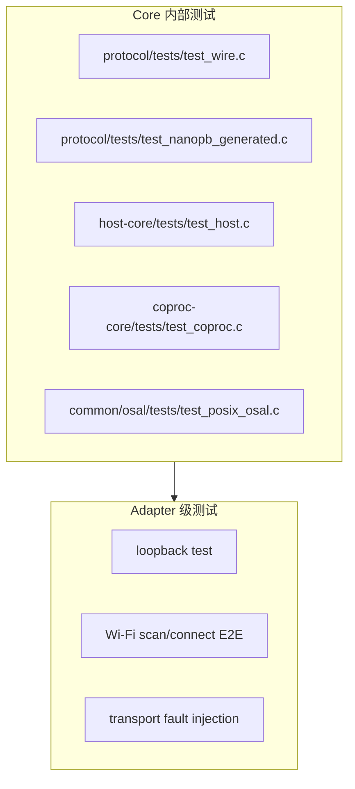
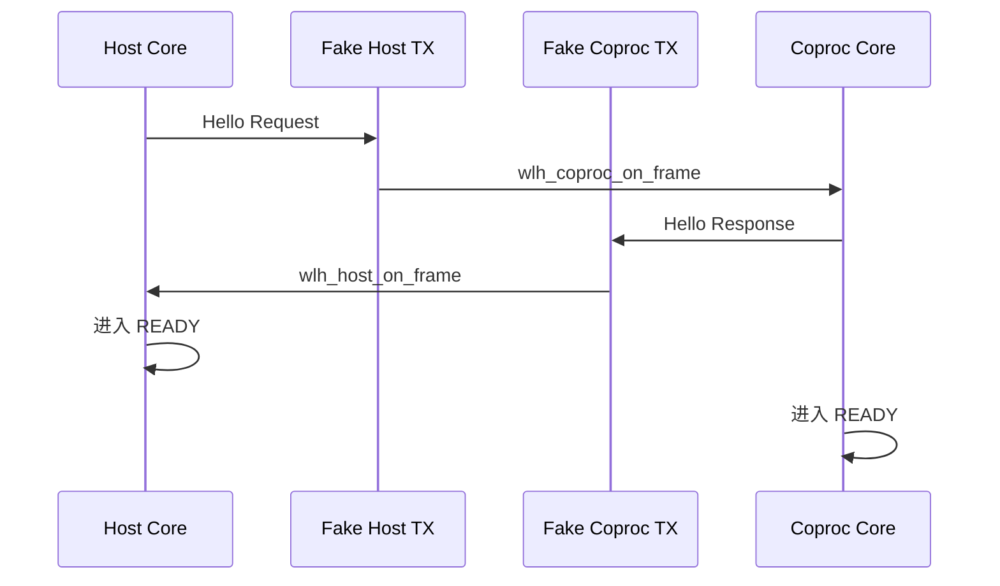

# WL-hosted Core 测试指南

本文档说明如何构建和测试 Core，以及如何为 Adapter 编写 mock OSAL、fake transport 和端到端测试。

## 构建矩阵

Core 支持多种构建配置：

```sh
# Debug + 测试
cmake -S . -B build-debug -DCMAKE_BUILD_TYPE=Debug -DBUILD_TESTING=ON
cmake --build build-debug --parallel
ctest --test-dir build-debug --output-on-failure

# Release + 测试
cmake -S . -B build-release -DCMAKE_BUILD_TYPE=Release -DBUILD_TESTING=ON
cmake --build build-release --parallel
ctest --test-dir build-release --output-on-failure

# AddressSanitizer
cmake -S . -B build-asan -DCMAKE_BUILD_TYPE=Debug -DBUILD_TESTING=ON -DCMAKE_C_FLAGS="-fsanitize=address -fno-omit-frame-pointer"
cmake --build build-asan --parallel
ctest --test-dir build-asan --output-on-failure

# 可移植性验证（不链接 pthread/测试框架）
cmake -S . -B build-portable -DCMAKE_BUILD_TYPE=Release -DBUILD_TESTING=OFF
cmake --build build-portable --parallel
```

可移植性验证用于确保 Core 在没有 POSIX 依赖时仍能编译，适合 MCU 集成前的检查。

## 测试结构



## mock OSAL

测试时可以实现一个最小 OSAL，例如基于 pthread：

```c
static int test_task_create(
    void *ctx, wlh_osal_task_t *task,
    const wlh_osal_task_attributes_t *attr,
    wlh_osal_task_fn entry, void *argument
) {
    test_task_state_t *state = (test_task_state_t *)task;
    memset(task, 0, sizeof(*task));
    state->entry = entry;
    state->argument = argument;
    return pthread_create(&state->thread, NULL, test_task_main, state);
}
```

关键要求：

- `queue_send` 支持阻塞等待。
- `mutex_lock` 在 timeout 为 0 时不阻塞。
- `monotonic_time_ms` 单调递增。
- 所有对象能放进 opaque struct。

Core 的 `host-core/tests/test_host.c` 和 `coproc-core/tests/test_coproc.c` 已经包含完整的 mock OSAL 示例，可以直接参考。

## fake transport

在单元测试中，transport 不需要真实硬件。一个最小 fake transport：

```c
typedef struct fake_transport {
    uint8_t last_frame[4096];
    size_t last_size;
    int start_status;
    int submit_status;
} fake_transport_t;

static int fake_start(void *ctx, wlh_transport_lifecycle_complete_fn cb, void *ccb) {
    fake_transport_t *t = ctx;
    cb(ccb, t->start_status);
    return 0;
}

static int fake_submit_tx(
    void *ctx, uint8_t *frame, size_t size,
    wlh_transport_tx_complete_fn cb, void *ccb
) {
    fake_transport_t *t = ctx;
    memcpy(t->last_frame, frame, size);
    t->last_size = size;
    cb(ccb, frame, size, t->submit_status);
    return 0;
}
```

注意：真实 transport 的 completion 不能 inline 调用，但 fake transport 为了测试方便可以同步调用。

## 使用测试钩子

定义 `WLH_ENABLE_TEST_HOOKS` 后，Core 暴露额外的测试函数：

```c
void wlh_host_test_set_credit(wlh_host_t *host, uint8_t channel, uint32_t credit);
void wlh_host_test_force_session_change(wlh_host_t *host, uint32_t session_id);
void wlh_host_test_expire_all(wlh_host_t *host);

void wlh_coproc_test_set_credit(wlh_coproc_t *coproc, uint8_t channel, uint32_t credit);
void wlh_coproc_test_reset_channel(wlh_coproc_t *coproc, uint8_t channel);
void wlh_coproc_test_reset_session(wlh_coproc_t *coproc, uint32_t reason);
```

这些函数用于强制触发 credit 变化、session 变化、RPC 超时等边界条件。

## loopback 测试

最简单的端到端测试：

1. 创建 Host Core 和 Coprocessor Core。
2. 让 fake transport 把 Host 发送的帧直接投递给 Coprocessor 的 `wlh_coproc_on_frame()`。
3. 让 Coprocessor 发送的帧直接投递给 Host 的 `wlh_host_on_frame()`。
4. 验证双方进入 READY。



## Wi-Fi 端到端测试

在 loopback 基础上：

1. Host 调用 `wlh_host_wifi_scan()`。
2. 验证 Coprocessor 收到 `WLH_WIFI_METHOD_SCAN_START`。
3. Coprocessor 注入多个 `wlh_coproc_wifi_scan_result()`。
4. Coprocessor 注入 `wlh_coproc_wifi_scan_completed()`。
5. Host 收到 `WLH_HOST_EVENT_WIFI_SCAN_RESULT` 和 `WLH_HOST_EVENT_WIFI_SCAN_COMPLETED`。

## transport 故障注入

测试恢复能力：

1. Core 进入 READY。
2. 调用 `wlh_host_transport_lost(host)` 或让 fake transport 返回错误。
3. 验证 Core 进入 RECOVERING。
4. 恢复 transport。
5. 验证 Core 重新进入 READY。

## 诊断与日志

测试中可通过诊断结构体验证行为：

```c
wlh_host_diagnostics_t diag;
wlh_host_get_diagnostics(host, &diag);
assert(diag.state == WLH_HOST_STATE_READY);
assert(diag.tx_frames > 0);
```

## 持续集成建议

- 每次提交前运行 Debug + Release + ASan 构建。
- 公共接口、OSAL、并发或生命周期改动需额外验证 Portable 构建。
- 保持 `-Wall -Werror` 无告警。

## 相关测试命令

```sh
# 运行所有测试
ctest --test-dir build-debug --output-on-failure

# 只运行 Host Core 测试
./build-debug/host-core/wlh_host_core_tests

# 只运行 Coprocessor Core 测试
./build-debug/coproc-core/wlh_coproc_core_tests

# 只运行 Wire 测试
./build-debug/protocol/wlh_protocol_tests
```

下一篇推荐阅读：[troubleshooting.md](troubleshooting.md)。
