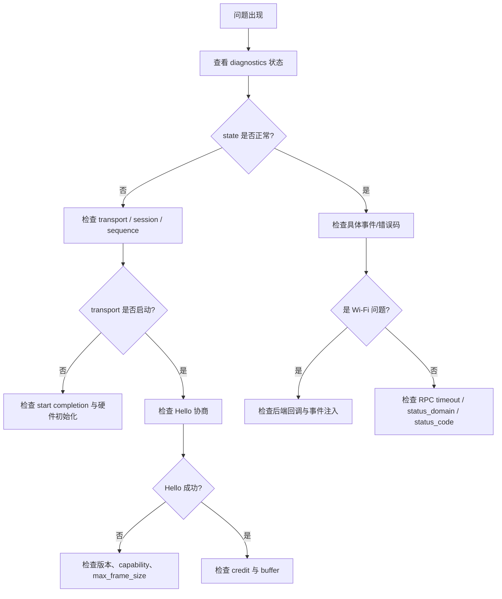

# WL-hosted Core 故障排查

本文档汇总 Core 集成与运行中的常见问题、排查思路与日志解读。

## 通用排查思路

遇到问题时，按以下顺序检查：



## 链路不通：Hello 协商失败

### 现象

Host Core 一直停留在 `WAITING_FOR_PEER` 或 `NEGOTIATING`，无法进入 `READY`。

### 检查项

1. transport 是否真正启动？查看 `transport.start` 的 completion 是否被调用且 status = 0。
2. Coprocessor 是否已启动并进入 `WAITING_FOR_HELLO`？
3. Host 发送的 Hello Request 是否到达 Coprocessor？可检查 fake transport 或硬件 sniffer。
4. 帧的 magic、protocol_major、header_size 是否正确。
5. `max_frame_size` 两端是否一致或兼容（Coprocessor 必须 ≥ Host 请求值）。
6. checksum 模式是否协商一致。

### 常见原因

- `transport.start` 同步调用 completion，导致 Core 在 transport 就绪前发送 Hello。
- `submit_tx` 成功后未调用 `tx_complete`，Core 认为 buffer 未释放而停止发送。
- 在 ISR 中调用 `wlh_host_on_frame()` / `wlh_coproc_on_frame()`，导致 OSAL 对象损坏。

## 状态机反复进入 RECOVERING

### 现象

Core 进入 READY 后不久又回到 RECOVERING。

### 检查项

1. 心跳是否超时？检查 `heartbeat_timeout_ms` 与对端 `heartbeat_interval_ms` 是否匹配。
2. 是否收到 session 不匹配的帧？检查 `wlh_host_test_force_session_change` 或后端是否错误复用 session。
3. sequence 是否连续？出现 gap 通常意味着帧丢失或乱序。
4. checksum 错误是否持续？可能是硬件信号完整性问题或校验模式不匹配。
5. transport 是否被错误地标记为 lost？

## Credit 耗尽导致 CONGESTED

### 现象

数据 Channel 发送失败，返回 `NO_CREDIT`，状态变为 `CONGESTED`。

### 检查项

1. 对端是否发送了 `CREDIT_UPDATE`？
2. `initial_credit` 是否配置为 0 或过小？
3. 发送方是否在每帧后正确递减 credit？
4. 接收方是否及时释放 credit？

### 调试方法

使用测试钩子手动增加 credit：

```c
wlh_host_test_set_credit(host, WLH_CHANNEL_ETHERNET_STA, 16);
```

如果增加后恢复，说明 credit 更新路径有问题。

## Buffer 分配失败

### 现象

`diagnostics.buffer_allocation_failures` 递增，事件或 completion 丢失。

### 检查项

1. heap 是否耗尽？在 MCU 上建议使用静态 pool。
2. `max_frame_size` 是否过大？
3. 是否存在 buffer 泄漏？检查 `tx_complete` 中是否释放。
4. `core_queue_depth` 与 `max_pending_rpc` 是否配置合理？

## RPC 超时

### 现象

调用 Wi-Fi / 设备信息 API 后，completion 收到 `WLH_HOST_TIMEOUT`。

### 检查项

1. Coprocessor 是否收到请求？检查 fake transport 或日志。
2. Coprocessor 是否正确发送了 Response？
3. `rpc_timeout_ms` 是否过短？
4. pending table 是否已满？`diagnostics.pending_rpc` 是否达到 `max_pending_rpc`。
5. request_id 是否匹配？Response 必须复用 Request 的 service/method/request_id。

## Wi-Fi 扫描无结果

### 现象

Host 调用 `wlh_host_wifi_scan()` 后只收到 `SCAN_COMPLETED`，没有 `SCAN_RESULT`。

### 检查项

1. Coprocessor 的 `wifi.scan` 回调是否正确启动扫描？
2. 扫描结果是否通过 `wlh_coproc_wifi_scan_result()` 注入？
3. 注入的 `scan_id` 是否与请求一致？
4. 后端回调是否阻塞，导致 Core task 无法处理后续事件？

## Wi-Fi 连接不上

### 现象

Host 调用 `wlh_host_wifi_connect()` 后，要么超时，要么收到 DISCONNECTED。

### 检查项

1. SSID/credential/security 是否正确编码进 protobuf。
2. Coprocessor 的 `wifi.connect` 是否正确解析。
3. 厂商 SDK 连接结果是否映射到 `wlh_coproc_wifi_connected()` / `wlh_coproc_wifi_disconnected()`。
4. 是否在 ISR 中调用这些注入 API？

## Ethernet 数据丢失

### 现象

应用收不到 Ethernet 帧或发送失败。

### 检查项

1. Host 是否调用 `wlh_host_ethernet_sta_send()` 发送？
2. Coprocessor 的 `ethernet_sta_rx` 是否正确把帧交给网络栈？
3. 数据面是否走 `WLH_CHANNEL_ETHERNET_STA`，而不是 `CONTROL_RPC`？
4. MTU 是否超过协商的 `max_frame_size - header_size - record_header`？

## OSAL 相关死锁

### 现象

Core task 卡死，不处理事件。

### 检查项

1. `mutex_lock` 是否在 `WLH_OSAL_WAIT_FOREVER` 时正确阻塞。
2. 是否在 `on_event` / completion 回调中再次调用 Core API 导致递归死锁。
3. `queue_send` 是否在队列满时未唤醒等待的接收方。
4. `event_wait` 的 `clear_on_exit` 是否清除了不应清除的位。

## 诊断字段速查

| 字段 | 含义 | 异常时排查方向 |
|---|---|---|
| `state` | 当前状态 | 查看 lifecycle.md |
| `session_id` | 当前 session | 检查 Hello 与恢复 |
| `pending_rpc` | 挂起 RPC 数 | 检查超时与响应匹配 |
| `tx_frames` / `rx_frames` | 收发帧数 | 检查链路是否活跃 |
| `rpc_timeouts` | RPC 超时次数 | 检查对端响应与时钟 |
| `checksum_errors` | 校验错误数 | 检查硬件信号/校验模式 |
| `sequence_gaps` | sequence 跳变 | 检查丢帧/乱序 |
| `peer_resets` | 对端 reset 次数 | 检查 recovery 频率 |
| `transport_resets` | transport 重启次数 | 检查硬件稳定性 |
| `buffer_allocation_failures` | buffer 分配失败 | 检查内存/泄漏 |
| `last_peer_activity_ms` | 上次对端活动时间 | 检查心跳 |

## 上报问题前准备

如果上述步骤无法解决，请收集以下信息：

1. Host 与 Coprocessor 的 `wlh_host_diagnostics_t` / `wlh_coproc_diagnostics_t`。
2. 双方配置：`max_frame_size`、`heartbeat_timeout_ms` / `heartbeat_interval_ms`、`initial_credit`。
3. 抓取的 wire frame（至少包含 Hello Request/Response）。
4. 平台与 RTOS 版本。
5. 最小复现步骤或测试用例。

下一篇推荐阅读：[migration_guide.md](migration_guide.md)。
