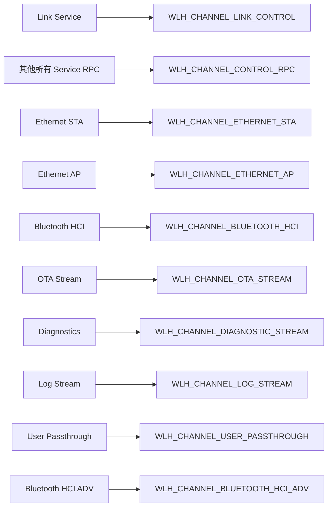
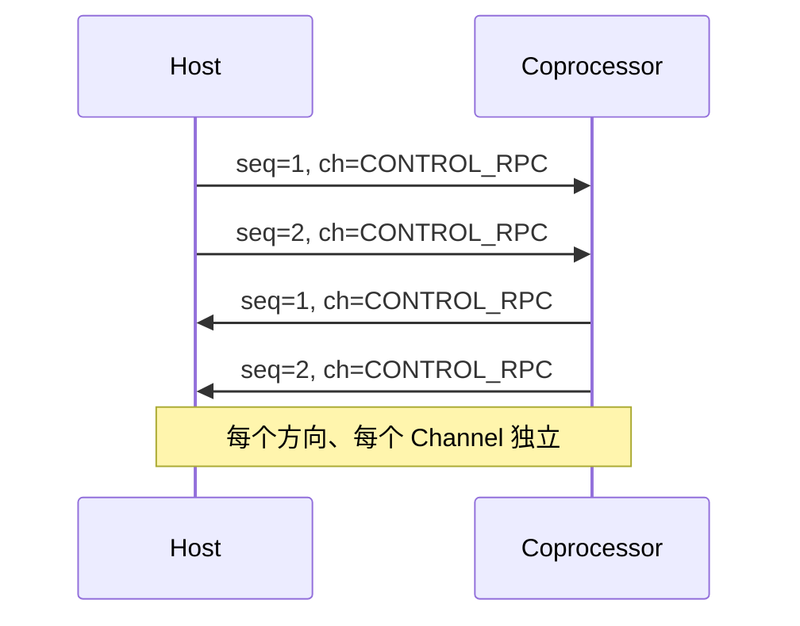

# Core 中的 Wire Protocol 使用

`wlh_protocol` 是 Core 与 Adapter 共享的固定 Frame/RPC 编解码库。它不依赖 protobuf 或 nanopb runtime，可离线构建和测试。本文档说明如何在 Core 内部使用这些 API。

## 包含头文件

```c
#include "wlh/protocol.h"
```

该头文件会引入：

- `wlh/protocol/wire.h`：Frame/RPC 编解码、校验和。
- `wlh/protocol/ids.h`：Channel、Service、Method、Status 常量。
- `wlh/protocol/endian.h`：little-endian helper。

## Frame 编解码

### 构造并发送一帧

```c
uint8_t frame[WLH_FRAME_MAX_SIZE];
size_t frame_size = 0;
wlh_frame_header_t header;

wlh_frame_header_init(&header, WLH_CHANNEL_CONTROL_RPC);
header.session_id = host->session_id;
header.sequence = host->tx_sequence[WLH_CHANNEL_CONTROL_RPC]++;

wlh_wire_result_t rc = wlh_frame_encode(
    frame, sizeof(frame), &frame_size,
    &header, payload, payload_size
);
if (rc != WLH_WIRE_OK) {
    // 处理错误
}

// 通过 transport 发送
transport->submit_tx(transport->context, frame, frame_size, tx_complete, host);
```

### 接收并解码一帧

```c
wlh_frame_header_t header;
const uint8_t *payload = NULL;
size_t payload_size = 0;

wlh_wire_result_t rc = wlh_frame_decode(
    &header, &payload, &payload_size,
    frame, frame_size, host->config.max_frame_size
);
if (rc != WLH_WIRE_OK) {
    // 处理错误
}

if (header.channel == WLH_CHANNEL_CONTROL_RPC) {
    // 解析 RPC Envelope
}
```

### 校验模式

Frame 支持两种校验：

- **SUM32**：无符号 32 位累加和，计算时 `header_checksum` 字段置 0。
- **CRC32C**：Castagnoli 多项式。

标志位 `WLH_FRAME_FLAG_CRC32C_PRESENT` 决定是否使用 CRC32C。默认使用 SUM32；CRC32C 能力在 Hello 中协商。

```c
header.flags |= WLH_FRAME_FLAG_CRC32C_PRESENT;
```

## RPC Envelope 编解码

### 构造 RPC Request

```c
uint8_t rpc[WLH_RPC_ENVELOPE_SIZE + payload_size];
size_t rpc_size = 0;
wlh_rpc_envelope_t envelope = {0};

envelope.service_id = WLH_SERVICE_WIFI;
envelope.method_id = WLH_WIFI_METHOD_SCAN_START;
envelope.request_id = next_request_id++;
envelope.kind = WLH_RPC_KIND_REQUEST;
envelope.payload_size = payload_size;

wlh_rpc_encode(
    rpc, sizeof(rpc), &rpc_size,
    &envelope, payload, payload_size
);
```

### 构造 RPC Response

```c
envelope.kind = WLH_RPC_KIND_RESPONSE;
envelope.status_domain = WLH_STATUS_DOMAIN_WIFI;
envelope.status_code = WLH_STATUS_OK;
// payload 可选
```

### 构造 RPC Event

```c
envelope.kind = WLH_RPC_KIND_EVENT;
envelope.request_id = original_request_id;  // 关联异步请求，或 0
envelope.status_domain = WLH_STATUS_DOMAIN_NONE;
envelope.status_code = WLH_STATUS_OK;
```

### 解码 RPC

```c
wlh_rpc_envelope_t envelope;
const uint8_t *payload = NULL;
size_t payload_size = 0;

wlh_rpc_decode(
    &envelope, &payload, &payload_size,
    rpc, rpc_size, negotiated_max_rpc_payload
);
```

## Channel 路由

Service 到 Channel 的映射是固定的：



控制面 RPC 不得使用数据 Channel；数据面大数据也不得塞进 protobuf payload。

## Sequence 管理

每个方向、每个 Channel 的 sequence 独立递增：

```c
header.sequence = host->tx_sequence[channel]++;
```

接收方检查 `expected_rx_sequence[channel]`，发现 gap 时触发恢复。



## Credit 管理

数据 Channel 使用 per-channel credit：

- 发送非 LINK_CONTROL 帧前，Core 检查 `tx_credit[channel]`。
- 每发送一帧，`tx_credit[channel]` 减 1。
- 对端通过 Link `CREDIT_UPDATE` 增加 credit。
- credit 为 0 时 Core 进入 CONGESTED 状态。

```c
if (channel != WLH_CHANNEL_LINK_CONTROL && coproc->tx_credit[channel] == 0) {
    coproc->state = WLH_COPROC_STATE_CONGESTED;
    return WLH_COPROC_NO_CREDIT;
}
```

## Session 管理

Session ID 在 Hello 协商时确定：

- Host 发送 Hello Request 时 session_id = 0。
- Coprocessor 在 Hello Response 中分配 session_id。
- 后续所有帧必须携带当前 session_id。
- 收到 session 不匹配的帧时触发恢复。

## 校验和使用示例

```c
uint32_t sum = wlh_sum32(data, size);
uint32_t crc = wlh_crc32c(data, size);
```

`wlh_frame_encode()` 会自动计算并填充 header_checksum 与 payload_checksum，通常不需要直接调用这些函数。

## 与 Core 的关系

Host Core 和 Coprocessor Core 内部已经封装了上述大部分逻辑。Adapter 通常只需要：

1. 通过 `wlh_host_on_frame()` / `wlh_coproc_on_frame()` 把原始帧交给 Core。
2. 在 `submit_tx` 中把 Core 编码好的帧发送出去。
3. 在 Hello 协商之外，不要自行构造或解析 RPC Envelope。

只有在实现特殊工具（如 Manager 的裸 wire 桥接）时，才需要直接调用 `wlh_protocol`。

## 常见错误

- 在 Hello 协商前使用非零 session_id。
- 混淆 Request/Response/Event 的 `kind`。
- 把大数据面内容塞进 `CONTROL_RPC`。
- 发送帧后未递减 credit。
- 使用 wall clock 计算心跳超时。

下一篇推荐阅读：[testing.md](testing.md)。
